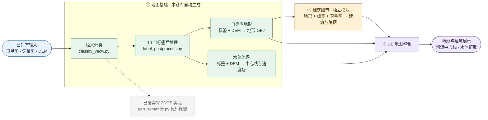
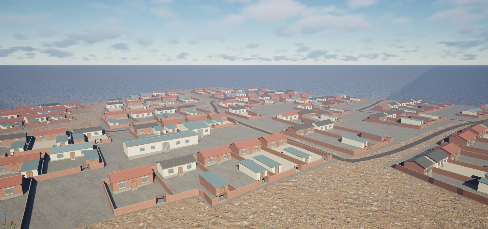
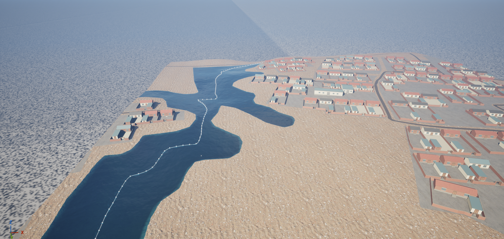
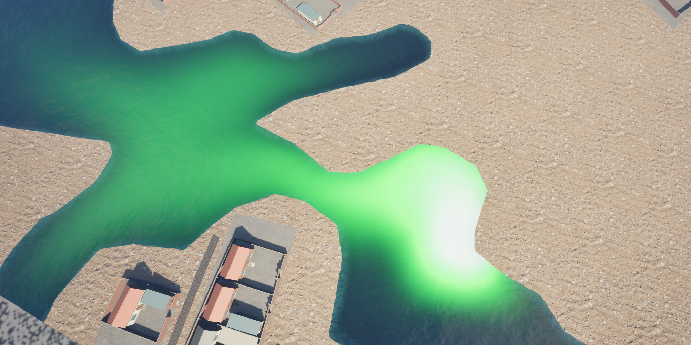

# 3DMapRebuilder

本项目已打通单区域地图从语义分类、标签后处理、自适应地形与水体流场生成，到独立建筑细节制作、UE 地图展示与水体扩散的完整演示流程。**当前尚待支持的是多区域地图**；建筑细节是地图生成链中的独立阶段，由用户在同级目录的 [`SanHe_Building_Module_Standalone`](https://github.com/getyo/SanHe_Building_Module_Standalone) 手动启动，位于地形产物之后、UE 导入之前，不属于本仓库的一键脚本。它读取同一轮的 Building 地形、Ground 上下文、建筑 Label、卫星图和坐标函数，交付可与原地形叠加的建筑及院落细节 OBJ。独立模块的看图规划和视觉验收依赖 **GPT-6 Astra（中等推理强度）**；Python/Blender 执行确定性计算和建模。

早期方案曾尝试生成 **3DGS 语义地图**。这条路线现已废弃，不参与当前地图生成流程；`gen_semantic.py` 代码仍保留在仓库中，供追溯或单独实验，不应将其产物 `semanticMap.ply` 当作现行交付物。

测试区域：河北三河鲍邱河附近农村区，约 0.47×0.47 km（117.0991°E, 39.8349°N 为中心），面积约 0.22 km²。

## 一、数据源

| 数据 | 来源 | 规格 | 说明 |
|------|------|------|------|
| **天地图卫星图** | 天地图 WMTS `img_w` zoom 18 | ~0.46m/px, EPSG:4326 | 256×256 瓦片拼接为 GeoTIFF |
| **天地图矢量图** | 天地图 WMTS `vec_w` zoom 18 | ~0.46m/px, RGBA 瓦片 | 含语义颜色编码（水体/建筑/道路/地面） |
| **DEM 高程** | SRTM1 v3.0 (NASA) | 30m 级别（1 弧秒） | 三次立方插值升采样至卫星图分辨率 |

> **注意**：本仓库代码不包含输入数据的地理对齐和插值步骤。天地图瓦片下载、SRTM1 拼接、DEM 三次插值、卫星图与矢量图对齐等预处理需另行完成，当前直接使用已处理好的输入文件。且测试输入数据并不为全部数据源，只用了 16 个瓦片大小，大约 0.22 平方千米。

## 二、总体流程

现行演示流程分为本仓库自动生成、独立建筑细节制作和 UE 整合三个环节：

1. `classify_vecw.py` 和 `label_postprocess.py` 从对齐的矢量图生成 10 倍语义标签。
2. `gen_adaptive_terrain_centerline.py` 生成 Ground、Water、Building 地形 OBJ，并编排 `gen_water_flow.py` 生成水体中心线和速度场。这个一键入口的范围到此为止。
3. 用户单独启动建筑细节模块，用上述同一轮地图产物制作、验收和打包建筑与院落细节。
4. 在 UE 中叠加地形与建筑细节，使用水面、中心线及速度场呈现河流和扩散效果。UE 导入与表现不由本仓库的一键命令自动完成。

3DGS 语义地图方案已废弃；保留的 `gen_semantic.py` 仅供历史追溯或手动实验，不在现行流程中，也不是完成地图的前置条件。

## 三、系统架构



`map_common.py` 是地形、流场和建筑细节共用的坐标约定来源。OBJ 文件使用右手系、Z-up、厘米；中心线 CSV 直接用于 UE，Y 方向与文件侧 OBJ 的约定不同。建筑模块复制同一轮 `map_common.py` 并沿用原地形 OBJ 文件坐标，不额外翻转或重置原点。

### 实际效果预览

以下三张为用户提供的 UE 截图，分别展示建筑、河流与中心线、扩散表现；它们是效果预览，不代替各模块的输入、几何和导入验收记录。

| 建筑与院落 | 水体与中心线 | 水体扩散 |
|:--:|:--:|:--:|
|  |  |  |

## 四、模块输入输出

| 模块 | 核心类型 | 主要输入 | 主要输出 |
|------|----------|----------|----------|
| **VecClassifier** | 语义分类器 | `vec_raw.png`, `satellite.tif` | `water.tif`, `building.tif`, `road.tif`, `labels.tif` |
| **LabelPostprocessor** | 标签后处理器 | `labels.tif` | `labels_10x_no_boundary.tif`, `boundary_lines_10x.png`, `preview_classification_noboundary.png` |
| **SemanticMapBuilder（历史实验）** | 已废弃的 3DGS 语义地图工具，代码保留 | `labels.tif`, `dem.tif` | `semanticMap.ply`（仅手动实验，不属于现行交付） |
| **AdaptiveTerrainBuilder** | 自适应地形生成器 | `labels_10x_no_boundary.tif`, `boundary_lines_10x.png`, `dem.tif` | `terrain_ground.obj`, `terrain_water.obj`, `terrain_building.obj`（含各自 .mtl） |
| **建筑细节独立模块** | 独立会话规划、建模和验收；不在一键管线内 | 同一轮 Building/Ground OBJ、10 倍 Label、卫星图、坐标函数、风格参考 | 一个含 BuildingDetails 与 CourtyardDetails 两对象的 OBJ，另附 MTL 和贴图 |
| **WaterFlowBuilder** | 水体流场生成器 | `labels_10x_no_boundary.tif`（band1==0 水体掩膜）, `dem.tif` | 主流 `terrain_water_centerline.csv` + 河网/速度场预览 + `terrain_velocity_field.png` |
| **map_common** | 共享常量/坐标换算 | — | 各模块共享的像素尺寸、缩放、UE 坐标换算函数 |

### 建筑细节独立模块：地形之后、UE 导入之前

建筑细节由同级目录的 [`SanHe_Building_Module_Standalone`](https://github.com/getyo/SanHe_Building_Module_Standalone) 承担，是可选的下游制作阶段。它不在本仓库的一键管线中，也不由 `gen_adaptive_terrain_centerline.py` 调用；用户另行开启 Codex 对话，按独立模块的 [完整执行管线](https://github.com/getyo/SanHe_Building_Module_Standalone/blob/main/docs/建筑细节完整执行管线_独立版.md) 运行。该模块负责结合卫星图和风格参考规划房屋、附房、厂房、院墙、院门、铺地与院内视觉小路，并生成、验证和渲染新增低模细节。执行会话按独立模块设计使用 **GPT-6 Astra（中等推理强度）**，负责风格判断、布局规划和逐图视觉验收。这里仅说明衔接关系；具体字段、阶段、命令及验收规则以独立模块文档和 `run_config.json` 为准。

| 接口 | 独立模块目录中的默认路径 | 来源或作用 |
|------|------------------------|------------|
| 原建筑基础及材质 | `inputs/map/terrain_building.obj`、`inputs/map/terrain_building.mtl` | 本项目 `output/terrain_adaptive/` 中的原始 Building 产物副本；只用于贴地、坐标与验收，不进入细节 OBJ |
| 地面上下文及材质 | `inputs/map/terrain_ground.obj`、`inputs/map/terrain_ground.mtl` | 同一轮的 Ground 产物副本；用于同场对齐参考 |
| 建筑语义边界 | `inputs/map/labels_10x_no_boundary.tif` | 本项目 `TestInput/SanHe/Output_10x/` 的标签副本；Band 1 的 `40` 是新增建筑相关几何的硬边界 |
| 布局与坐标 | `inputs/map/satellite.tif`、`inputs/map/map_common.py` | 同一轮卫星图与坐标函数的副本；前者用于布局判断，后者用于复用原 OBJ 坐标约定 |
| 风格依据 | `inputs/style_references/`、`style_catalog/` | 按场景检查参考图和已批准参数；缺少适用风格依据时暂停并索取参考图 |
| 可选高程核对 | `run_config.json` 指定的 DEM | 已有原建筑基础时可选，具体以独立模块配置为准 |
| 正式交付 | `outputs/UE_Map/BuildingDetails.obj`、`outputs/UE_Map/BuildingDetails.mtl`、`outputs/UE_Map/textures/` | **一个 OBJ 内恰有** `BuildingDetails`（建筑）与 `CourtyardDetails`（院落）两个对象；另有导入说明和坐标报告 |

复制输入时应保持同一轮地图的影像、标签、OBJ 和坐标函数对应，不能把旧任务清单或旧建筑基础当作新地图输入。独立模块先做输入与坐标审计，再创建本轮风格和全图任务；代表效果经用户确认后才生成全图，随后进行几何、Label 边界和固定及随机真实材质图验收。运行需要 Python、Blender（含 `bpy`），以及脚本使用的 `numpy`、`rasterio`、`affine`、`shapely`、`Pillow`；Blender 可执行文件由独立模块的 `run_config.json` 配置，当前默认值是机器相关的绝对路径。

交付 OBJ 沿用原地形的右手系、Z-up、厘米文件坐标；导入 UE 时与原地形使用相同的导入和放置设置，不在文件侧额外翻转 Y、旋转或重置原点。原 `terrain_building.obj` 仍单独保留并与细节叠加；本模块不改写本项目的 Ground、Road、Water、水体流场或 UE 语义层。独立入口已有代表样本验证记录，但新独立版的全图 Stage 4–8 及最终 UE 导入尚需按该轮结果实际核对，不能把文档描述视为已完成交付。

## 五、使用说明

### 5.1 一键跑完整流程

```bash
python gen_adaptive_terrain_centerline.py
```

默认行为（缓存逻辑）：

1. `classify_vecw` 语义分类 —— `labels.tif` 已存在则跳过
2. `label_postprocess` 标签后处理 —— `labels_10x_no_boundary.tif` 与 `boundary_lines_10x.png` 已存在则跳过
3. 并行执行两路任务（各任务产物齐全则跳过，单路失败不中断另一路，失败详情见 `--out-dir/_logs/` 下对应日志）：
   - `AdaptiveTerrainBuilder` 地形 OBJ
   - `gen_water_flow` 水体河网 + 速度场（主流中心线 CSV + 分流衰减速度场）
4. 坐标对齐校验：主流中心线 CSV 是否落在水面 OBJ 的 AABB 内

> `gen_semantic.py` 属于已废弃的 3DGS 方案，代码仅保留供追溯或实验；现行地图生成不需要运行它。建筑细节也由独立模块手动启动，不属于这一键命令。

### 5.2 强制重新生成

```bash
# 全部重新生成（含已有中间文件）
python gen_adaptive_terrain_centerline.py --force

# 只重新生成指定部分，其余按缓存逻辑
python gen_adaptive_terrain_centerline.py --regenerate flow
python gen_adaptive_terrain_centerline.py --regenerate terrain,flow
python gen_adaptive_terrain_centerline.py --regenerate classify --regenerate postprocess
```

### 5.3 单独运行各模块

各模块均可独立运行，均提供命令行入口，支持通过参数覆盖默认路径：

```bash
# 语义分类
python classify_vecw.py --vec TestInput/SanHe/vec_raw.png --sat TestInput/SanHe/satellite.tif --out-dir TestInput/SanHe

# 标签后处理
python label_postprocess.py --input TestInput/SanHe/labels.tif --out-dir TestInput/SanHe/Output_10x

# 已废弃的 3DGS 语义地图：仅供历史实验
python gen_semantic.py --label TestInput/SanHe/labels.tif --dem TestInput/SanHe/dem.tif --out TestInput/SanHe/semanticMap.ply

# 水体流场（河网 + 速度场）
python gen_water_flow.py --label-10x TestInput/SanHe/Output_10x/labels_10x_no_boundary.tif --dem TestInput/SanHe/dem.tif --out-dir output/terrain_adaptive

# 地形 OBJ（单独跑地形，不触发完整管线）
python gen_adaptive_terrain_centerline.py --stage-terrain --label-dir TestInput/SanHe --dem TestInput/SanHe/dem.tif --out-dir output/terrain_adaptive
```

也可通过 `test()` 函数以编程方式调用：

```python
from classify_vecw import test
test(vec_path='...', sate_path='...', out_dir='...')

from label_postprocess import test
test(input_path='...', output_dir='...')

from gen_semantic import test
test(label_path='...', dem_path='...', out_path='...')

from gen_water_flow import test
test(label_10x_path='...', dem_path='...', out_dir='...')
```

### 5.4 命令行参数

```bash
python gen_adaptive_terrain_centerline.py --help
```

| 参数 | 默认值 | 说明 |
|------|--------|------|
| `--label-dir` | `TestInput/SanHe` | 输入标签目录 |
| `--dem` | `TestInput/SanHe/dem.tif` | DEM 路径 |
| `--out-dir` | `output/terrain_adaptive` | 地形 OBJ / 流场输出目录（并行任务日志在 `_logs/` 子目录） |
| `--boundary-step` | `1` | 边界采样步长（10x 像素） |
| `--velocity-res` | `2048` | 速度场纹理最长边像素数（传给 gen_water_flow） |
| `--velocity-seed` | `42` | Perlin 噪声随机种子（传给 gen_water_flow） |
| `--velocity-noise` | `0.15` | 流向噪声强度（弧度，传给 gen_water_flow） |
| `--velocity-branch-alpha` | `0.5` | 分流速度衰减幂次 α（传给 gen_water_flow） |
| `--velocity-branch-residual` | `0.1` | 分流末端残余速度因子（传给 gen_water_flow） |
| `--velocity-converge` | `0.0` | 向心偏转强度 k，0=关闭（传给 gen_water_flow） |
| `--force` | `False` | 强制重新生成所有产物（含已有中间文件） |
| `--regenerate` | `[]` | 只强制重新生成指定部分：`classify` / `postprocess` / `terrain` / `flow`，可重复指定或以逗号分隔 |

```bash
python gen_water_flow.py --help
```

| 参数 | 默认值 | 说明 |
|------|--------|------|
| `--label-10x` | `TestInput/SanHe/Output_10x/labels_10x_no_boundary.tif` | 10x 语义标签（水体 = band1 == 0） |
| `--dem` | `TestInput/SanHe/dem.tif` | DEM 路径 |
| `--out-dir` | `output/terrain_adaptive` | 输出目录 |
| `--velocity-res` | `2048` | 速度场纹理最长边像素数 |
| `--velocity-seed` | `42` | Perlin 噪声随机种子 |
| `--velocity-noise` | `0.15` | 流向噪声强度（弧度） |
| `--velocity-branch-alpha` | `0.5` | 分流速度衰减幂次 α，factor = max(residual, (1-d/L)^α) |
| `--velocity-branch-residual` | `0.1` | 分流末端残余速度因子（0~1） |
| `--velocity-converge` | `0.0` | 向心偏转强度 k，0=关闭（流线轻微弯向中心线） |

## 六、主要类型说明

### 6.1 VecClassifier

`classify_vecw.py` 中的类，将天地图矢量底图按颜色分类。

**输出格式（labels.tif 三通道）**：

| 通道 | 内容 | 值范围 |
|------|------|--------|
| Band 1 (class_id) | 语义类别 | 0=水体, 20=道路, 40=建筑, 60=地面 |
| Band 2 (road_level) | 道路等级 | 40=高速, 80=国道, 120=省道, 160=支路, 200=小路 |
| Band 3 (height) | 历史占位标记，不代表真实建筑高度 | 120=建筑, 0=其他 |

### 6.2 LabelPostprocessor

`label_postprocess.py` 中的类，对 `labels.tif` 做 10x 上采样与轮廓平滑。

### 6.3 SemanticMapBuilder

`gen_semantic.py` 中的历史实验类，从语义标签和 DEM 生成 3DGS PLY 点云。**该方案已废弃**；代码保留，可按 5.3 单独实验，但不参与现行地图流程或交付。

### 6.4 AdaptiveTerrainBuilder

`gen_adaptive_terrain_centerline.py` 中的类，从 10x 标签 + 边界线 + DEM 生成 UE 可用的自适应分辨率地形 OBJ（只负责地形网格，不生成水体流场数据）。

**坐标系**：
- OBJ 导出使用右手系 Z-up：`X=east, Y=-north, Z=height`。
- UE 导入 OBJ 时会做右手系→左手系转换，mesh 在 UE 里的实际坐标为 `X=east, Y=south, Z=height`。
- 常量与换算统一引用 `map_common.py`，与 `gen_water_flow.py` 保持一致。

**核心策略**：

1. 粗网格 stride = 10 原始像素（100 10x 像素）。
2. 从 `boundary_lines_10x.png` 细化出 1 像素宽 10x 边界线。
3. 粗网格顶点 + 密集边界点用 `scipy.spatial.Delaunay` 三角化，三角形大小自然自适应：内部大、边界密。
4. 每个三角形取重心位置的 10x class_id，分配到地面 OBJ 的 `M_Ground` / `M_Road` / `M_WaterBed` / `M_Building` 与水面 OBJ 的 `M_Water` 材质槽。
5. 水体通过 `distance_transform_edt` 生成凹包盆地，保留水边过渡。

### 6.5 WaterFlowBuilder

`gen_water_flow.py` 中的类，从 10x 水体掩膜（band1==0）+ DEM 生成水体河网与静态速度场，是独立模块，与地形网格无数据依赖，可与地形 OBJ 并行执行。

**河网分解（主流 + 分流）**：
- 水体掩膜下采样到最长边 2048 后骨架化，骨架图按连通分量处理（独立水体各自成网）。
- 每个分量的直径路径（最长最短路径）为主流，方向 A→B，速度因子恒为 1。
- 主流之外的边构成"分流树"，每条分流树以离 A 最近的汇口为根，方向从汇口指向自身末端（水从主流分流出去）。
- 分流内每个节点的速度因子 = max(residual, (1-d/L)^α)：d 为该节点离汇口的图上距离，L 为该分流树的最大离汇距离。α 默认 0.5，residual 默认 0.1。
- 汊道环（两端都接主流的环）按主流方向赋值、速度因子恒 1 不做衰减。

**速度场生成**：
- 每个水体像素取最近河网节点的切向为主方向，近岸处混入岸边切线（高斯模糊 + Sobel 梯度）。
- 速度 = 横向廓线（按局部半宽归一：中心快岸边慢） × 分流因子 × (1 + 0.2×噪声)，其中横向位置 p = 离最近河网节点距离 / 局部半宽。
- 可选向心偏转（`--velocity-converge` k）：方向轻微弯向中心线，强度 s = k·4p(1-p)·factor，中心/岸边/分流远端均收敛；k=0 关闭。

**中心线 CSV**：只输出主流一条折线（UE DataTable 格式，供 Spline 导入），分流不写入 CSV（UE 端一条 Spline 语义不变）。河网全貌见预览图。

**预览图**：白底黑水，主流红色 10px，分流按速度因子 JET 着色 5px（红=快≈汇口，蓝=慢≈末端）。

### 6.6 map_common

`map_common.py` 提供共享常量（`PX_M` = 0.458 m/px、`SCALE` = 10、`UE_SCALE` = 100）与 10x 像素 → UE 世界坐标的换算函数（`ue_x_of_col` / `ue_y_obj_of_row` / `ue_y_csv_of_row`）。地形 OBJ 与水体流场必须引用同一份常量，禁止各自另写，防止 UE 内错位。

## 七、输入文件

`TestInput/SanHe/` 下需要预先准备：

| 文件 | 尺寸 | 说明 |
|------|------|------|
| `satellite.tif` | 1024×1024 | 天地图 RGB 卫星图，EPSG:4326，~0.46m/px |
| `vec_raw.png` | 1024×1024 | 天地图 vec_w RGBA 拼接图，4×4 = 16 张瓦片（zoom 18，256px/片） |
| `dem.tif` | 1024×1024 | float32 高程，与卫星图对齐，30m SRTM1 三次插值 |

## 八、输出文件

- `TestInput/SanHe/water.tif` — 水体二值掩膜
- `TestInput/SanHe/building.tif` — 建筑二值掩膜
- `TestInput/SanHe/road.tif` — 道路二值掩膜
- `TestInput/SanHe/labels.tif` — 三通道语义标签
- `TestInput/SanHe/semanticMap.ply` — 已废弃的 3DGS 方案的实验产物；仅手动运行 `gen_semantic.py` 时可能生成，不属于现行输出
- `TestInput/SanHe/Output_10x/labels_10x_no_boundary.tif` — 10x 上采样语义标签
- `TestInput/SanHe/Output_10x/boundary_lines_10x.png` — 独立轮廓线图
- `TestInput/SanHe/Output_10x/preview_classification_noboundary.png` — 分类预览图
- `output/terrain_adaptive/terrain_ground.obj` — 地面/道路/水体凹包 + 建筑裙边
- `output/terrain_adaptive/terrain_ground.mtl` — 地面材质定义
- `output/terrain_adaptive/terrain_water.obj` — 蓝色水面盖子
- `output/terrain_adaptive/terrain_water.mtl` — 水面材质定义
- `output/terrain_adaptive/terrain_building.obj` — 建筑核心区域顶面
- `output/terrain_adaptive/terrain_building.mtl` — 建筑材质定义
- `output/terrain_adaptive/terrain_water_centerline.csv` — 主流中心线点序列（UE DataTable 格式，仅主流一条）
- `output/terrain_adaptive/terrain_water_centerline_preview.png` — 河网预览图（白底黑水，主流红 + 分流按速度因子着色）
- `output/terrain_adaptive/terrain_velocity_field.png` — 水体静态速度场纹理（PNG，BGRA）：B=速度大小，G=世界空间流向 Y，R=世界空间流向 X，A=水体掩膜
- `output/terrain_adaptive/terrain_velocity_field_preview.png` — 速度场流向可视化预览（V-up 布局，与 UE 纹理一致）
- `output/terrain_adaptive/_logs/` — 并行阶段各任务的运行日志（`terrain.log` / `flow.log`）

## 九、速度场纹理设计与水体扩散管线

### 9.1 速度场纹理设计

速度场离线生成，导出 PNG 后导入 UE 作为 Texture2D，按水体 mesh 的 UV 直接采样。

> **通道说明（PNG 读回为 BGRA）**：由于导出时做了 RGBA→BGRA 转换，在 UE 里按 RGBA 采样时 R=世界空间流向 X、G=世界空间流向 Y、B=速度大小、A=水体掩膜。

| 通道 | 内容 | 说明 |
|------|------|------|
| **R** | 世界空间流向 X（-1~1 映射到 0~1） | 归一化方向，河网切向 + 岸边加权 + Perlin 噪声（可选向心偏转） |
| **G** | 世界空间流向 Y（-1~1 映射到 0~1） | 同上 |
| **B** | 速度廓线系数（0~1） | 中心≈1、岸边→0 × 分流因子（主流 1、分流远端→residual），叠加轻微噪声 |
| **A** | 水体掩膜 | 1 = 有效水体区域，0 = 非水体/无效 |

**UV 对齐**：水体 mesh 的 UV AABB 为 `[0,1]×[0,1]`。速度场纹理按 V-up 生成（PNG 顶部存图像底部），与 UE 导入 OBJ 后的 mesh UV 方向一致，采样时直接按水体 UV 取即可吻合。

**方向计算（Python 端）**：
1. 河网骨架化后，每个水体像素找最近河网节点，取其切向为基础流（主流 A→B，分流从汇口指向末端）。
2. 近岸处混入岸边切线（高斯模糊 + Sobel 梯度），按横向位置 p = 离最近河网节点距离 / 局部半宽加权：中心以河网切向为主，近岸岸边切线影响增大。
3. 可选向心偏转（`--velocity-converge`）：方向再叠加"指向中心"的横向分量，强度 s = k·4p(1-p)·factor，k=0 关闭。
4. 叠加低频分形 Perlin 噪声扰动，归一化后存 R/G。

**速度大小（Python 端）**：
- 以横向位置 p 控制基础速度：河道中心快、岸边慢（横向廓线 = 1-p，半宽按当地河网节点计算，窄支流不被主流宽度压制）。
- 乘以分流因子：主流=1，分流沿 (1-d/L)^α 递减到 residual。
- 叠加低频噪声做轻微速度扰动，最终 B = 横向廓线 × 分流因子 × (1 + 0.2×噪声)，范围裁剪到 [0, 1]。

**速度大小（UE 端）**：
- Python 已输出方向和带扰动的速度标量。
- UE 中 `BaseSpeed` Scalar 参数控制整体流速。
- 最终速度 = `normalize(R,G) × BaseSpeed × B`。向心偏转已烤进 R/G 方向，UE 无需额外处理。

**污染源**：完全独立，用户另行控制注入位置和颜色，速度场只负责"已注入的物质怎么被带走"。

### 9.2 水体扩散实现管线

```
Python 端
  │
  ├── 输入：天地图矢量图 → classify_vecw.py → labels.tif
  │
  ├── label_postprocess.py → labels_10x_no_boundary.tif（10x 水体掩膜）
  │
  └── gen_water_flow.py（与地形 OBJ 并行）
        │
        ├── 骨架化 → 河网分解（主流 A→B + 分流树）
        ├── 提取 terrain_water_centerline.csv（主流，UE DataTable 导入）
        ├── 生成 terrain_water_centerline_preview.png（河网人工校验）
        └── 生成 terrain_velocity_field.png（分流衰减 + 向心偏转速度场）

UE 端
  │
  ├── 导入 terrain_water.obj 为 Static Mesh
  │
  ├── 创建蓝图结构体 FCenterlinePoint（x, y, z）
  │
  ├── 导入 CSV 为 DataTable（Row Type = FCenterlinePoint）
  │
  ├── 在 BP_RiverWater 蓝图中：
  │     For Each Loop 读取 DataTable → Break FCenterlinePoint
  │     → Make Vector → Add Spline Point
  │     生成沿主流中心的 Spline
  │
  ├── 扩散 RT 模拟：
  │     扩散 Grid 的每个格子按水体 UV 采样速度场 Texture，
  │     用速度方向做 Semi-Lagrangian Advection，实现污染物随水流扩散；
  │     分流区域因 B 通道衰减而流速递减，流线向心偏转使污染物自然
  │     汇聚向主流中心。
  │
  └── 如需动态/更复杂河岸插值，可在 UE 中按 Spline 实时生成速度场 RT 替代静态纹理。
```

## 十、待办

- [ ] 多区域地图支持：将目前在河北三河单一区域完成的流程推广到其他区域，并逐区域核对输入对齐、风格适配、坐标和 UE 展示。
